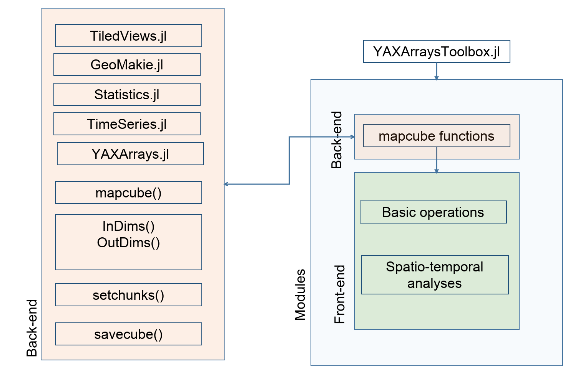
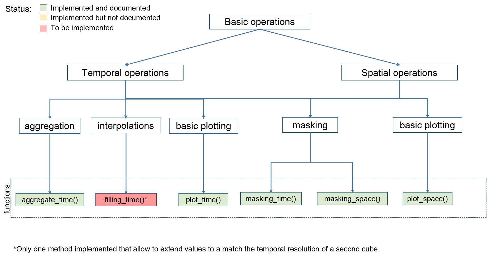
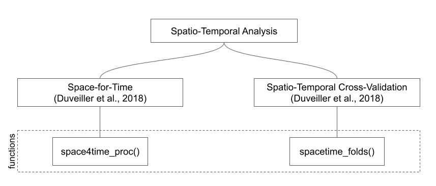

# YAXArraysToolbox.jl

| **Documentation**                                                               | **Build Status**                                                                                | **Citation** |
|:-------------------------------------------------------------------------------:|:-----------------------------------------------------------------------------------------------:|:-----------------------------------------------------------------------------------------------:|
| [](https://dpabon.github.io/YAXArraysToolbox.jl/stable/) [](https://dpabon.github.io/YAXArraysToolbox.jl/dev/) | [](https://github.com/dpabon/YAXArraysToolbox.jl/actions/workflows/CI.yml?query=branch%3Amain) [](https://codecov.io/gh/dpabon/YAXArraysToolbox.jl) | [](https://zenodo.org/badge/latestdoi/617361484) |

Yet Another Toolbox to analyze spatio-temporal data using [YAXArrays.jl](https://github.com/JuliaDataCubes/YAXArrays.jl). Because laziness is not only good when reading big data.

## What can the YAXArraysToolbox package do for you?

The YAXArraysToolbox package take advantage of the YAXArrays MapCube function to effienctly perform basic operations as data aggregation and plotting on gridded data. Furthermore the YAXArraysToolbox can perform some spatio-temporal analysis. The package is structured in two modules 'BasicOperations' and 'SpatioTemporalAnlyses'. The structure and dependencies of the package is:

### Dependencies




### Modules and functions

**BasicOperations**



**SpatioTemporalAnalyses**




## Installation

```julia
julia> ]
pkg> add https://github.com/dpabon/YAXArraysToolbox.jl#main
```
or

```julia
using Pkg

Pkg.add(url = "https://github.com/dpabon/YAXArraysToolbox.jl#main")

```
Start using the package:

```julia
using YAXArraysToolbox

```


## Tutorials (Jupyter Notebooks)

https://github.com/dpabon/YAXArraysToolboxNotebooks

## Problems/Questions?

Please check the [issues](https://github.com/dpabon/YAXArraysToolbox.jl/issues) page to see if your question has already been solved, or  open a new issue describing your problem/question.

## How to Contribute?

We're more than happy to receive contributions! Feel free to open pull requests.

## License

[MIT License](https://github.com/dpabon/YAXArraysToolbox.jl/blob/main/LICENSE)


## Acknowledgements

This project was funded by the [Open-Earth-Monitor project](https://earthmonitor.org/) and the [NFDI4Earth](https://www.nfdi4earth.de/) project.

<a href="https://earthmonitor.org/">


<a href="https://www.nfdi4earth.de/">

