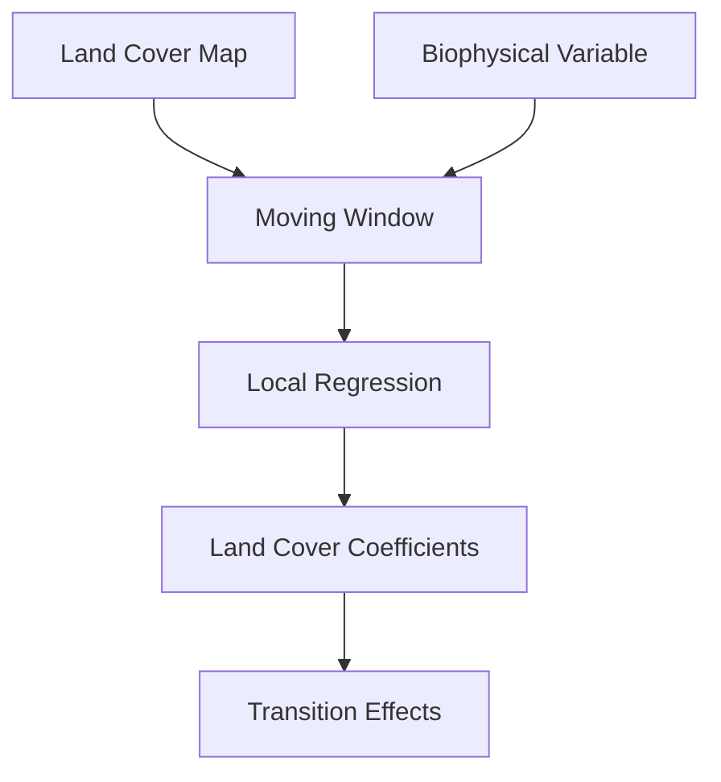

# [Space-for-Time Method](@id space4time)

```@raw html
<div style="background: linear-gradient(135deg, #11998e 0%, #38ef7d 100%); color: white; padding: 2em; border-radius: 8px; margin-bottom: 2em;">
  <h2 style="margin: 0; color: white;">🌍 Proof of Concept: Space-for-Time Analysis</h2>
  <p style="margin: 0.5em 0 0 0; opacity: 0.9;">Estimate land cover change impacts using spatial variability</p>
</div>
```

**Author:** Daniel E. Pabon-Moreno

---

## Overview

Land use changes have significant consequences on the Earth system's energy budget. For example, deforestation of tropical rainforests profoundly impacts carbon and water cycles at local, regional, and global scales.

The **space-for-time method** uses local vegetation contrasts to disentangle the effects of land use changes on biophysical variables like Land Surface Temperature (LST).

!!! info "What You'll Learn"
    - The theoretical basis of the space-for-time method
    - How to generate synthetic test data
    - How to run and interpret `space4time_proc` results
    - How to filter results using R² and co-occurrence thresholds

---

## Setup

```@example space4time
using Pkg
Pkg.add(url="https://github.com/JuliaStats/GLM.jl", rev="f4047d4930957bc5317fd4d0b73f197383a4ee4a")
Pkg.add(url = "https://github.com/dpabon/YAXArraysToolbox.jl")
using SkipNan
using YAXArraysToolbox
using YAXArrays
using Zarr
using CairoMakie
using GeoMakie
using Random
using NeutralLandscapes
using TiledViews
using DimensionalData
using Statistics
```

```@example space4time
# Set temporary directory for YAXArrays
YAXArrays.YAXdir("/tmp/YAXA_tmp")

# Activate CairoMakie for plotting
CairoMakie.activate!()
```

---

## The Space-for-Time Method

### Conceptual Framework

The space-for-time method is based on a key assumption: **spatial variability** in land cover within a local area can serve as a proxy for **temporal changes** in land cover.

```@raw html
<div style="background: #f8f9fa; border: 1px solid #dee2e6; border-radius: 8px; padding: 1.5em; margin: 1.5em 0;">
  <h4 style="margin-top: 0;">🔑 Key Insight</h4>
  <p>If we observe how Land Surface Temperature varies across different land cover types <em>within a small moving window</em>, we can estimate the temperature change that would occur if the land cover <em>changed over time</em>.</p>
</div>
```

### Algorithm Steps

The method follows these steps:

1. **Define a moving window** over the study area
2. **Within each window**, analyze the relationship between land cover composition and the target variable
3. **Use regression** to estimate the contribution of each land cover type
4. **Calculate transition effects** when converting between land cover types



---

## Generating Synthetic Data

To demonstrate the method, we'll create synthetic land cover and temperature data with known properties.

### Step 1: Create a Land Cover Map

We'll generate a 1000 × 1000 pixel land cover map (1 pixel = 1 meter, so 1 km × 1 km total):

```@example space4time
edge = 1000
size_tile = (edge, edge)
```

Generate a spatially autocorrelated pattern using midpoint displacement:

```@example space4time
Random.seed!(232323)
spatial_auto = 0.9
midpoint_sim = rand(MidpointDisplacement(spatial_auto), size_tile)
heatmap(midpoint_sim)
```

Classify into 3 land cover classes:

```@example space4time
n_classes = 3
classes_dist = NeutralLandscapes.classify(midpoint_sim, ones(n_classes))
```

```@example space4time
heatmap(classes_dist)
```

### Step 2: Assign LST Values per Class

We define a constant Land Surface Temperature (LST) for each class:

```@example space4time
# LST values per class (°C)
class_1_lst = 20.0  # e.g., Forest (coolest)
class_2_lst = 22.0  # e.g., Grassland
class_3_lst = 23.8  # e.g., Cropland (warmest)

all_lst = (class_1_lst, class_2_lst, class_3_lst)

# Create LST map
lst = fill(NaN, size_tile)

for i in eachindex(all_lst)
    lst[findall(==(i), classes_dist)] .= all_lst[i]
end
```


---

## Spatial Resampling

Land cover maps typically have coarser resolution than 1 meter. We'll aggregate to a new spatial resolution and estimate the frequency of each class per pixel.

### Resample Land Cover Classes

```@example space4time
size_pixel_new = 20  # New pixel size: 20×20 = 400 original pixels

# Use TiledView to create views of each new pixel
a = TiledView(classes_dist, (size_pixel_new, size_pixel_new), (0, 0); keep_center = false, pad_value = NaN32)

# Array for resampled class frequencies
new_res_array_classes = fill(0.0, (size_pixel_new, size_pixel_new, n_classes))

for i in 1:size_pixel_new
    for j in 1:size_pixel_new
        for c in 1:n_classes
            new_res_array_classes[i, j, c] = count(==(c), a[:, :, i, j]) / (size_pixel_new^2)
        end
    end
end
```

Visualize the class frequencies:

Class 1:

```@example space4time

fig = Figure()
ax = Axis(fig[1, 1]; xlabel = "x", ylabel = "y", title = "Class 1 Frequency")
temp = heatmap!(new_res_array_classes[:, :, 1], colormap = Reverse(:bamako))
Colorbar(fig[1, 2], temp, label = "Occurrence")
fig
```

Class 2:

```@example space4time

fig = Figure()
ax = Axis(fig[1, 1]; xlabel = "x", ylabel = "y", title = "Class 2 Frequency")
temp = heatmap!(new_res_array_classes[:, :, 2], colormap = Reverse(:bamako))
Colorbar(fig[1, 2], temp, label = "Occurrence")
fig
```

Class 3:

```@example space4time
fig = Figure()
ax = Axis(fig[1, 1]; xlabel = "x", ylabel = "y", title = "Class 3 Frequency")
temp = heatmap!(new_res_array_classes[:, :, 3], colormap = Reverse(:bamako))
Colorbar(fig[1, 2], temp, label = "Occurrence")
fig
```

```@example space4time
fig = Figure()
ax = Axis(fig[1, 1]; xlabel = "x", ylabel = "y", title = "Altitude Std Dev")
temp = heatmap!(new_res_array_altitude[:, :, 2], colormap = :lajolla)
Colorbar(fig[1, 2], temp, label = "Altitude (m)")
fig
```

### Resample LST

```@example space4time
a = TiledView(lst_altitude_corrected, (size_pixel_new, size_pixel_new), (0, 0); keep_center = false)

new_res_array_lst = fill(NaN, (size_pixel_new, size_pixel_new))

for i in 1:size_pixel_new
    for j in 1:size_pixel_new
        new_res_array_lst[i, j] = mean(a[:, :, i, j])
    end
end
```

```@example space4time
fig = Figure()
ax = Axis(fig[1, 1]; xlabel = "x", ylabel = "y", title = "Mean LST")
temp = heatmap!(new_res_array_lst[:, :], colormap = :lajolla)
Colorbar(fig[1, 2], temp, label = "LST (°C)")
fig
```

---

## Organizing Data as YAXArrays

### Land Cover Cube

```@example space4time
axlist = (
    lon(1:size(new_res_array_classes, 1)),
    lat(1:size(new_res_array_classes, 2)),
    Variables(["class$i" for i in 1:n_classes])
)

lcc_cube = YAXArray(axlist, new_res_array_classes)
lcc_cube
```

### LST Cube

```@example space4time
axlist_lst = (
    lon(1:size(new_res_array_lst, 1)),
    lat(1:size(new_res_array_lst, 2))
)

lst_cube = YAXArray(axlist_lst, new_res_array_lst)
lst_cube
```

---

## Running Space4Time Analysis

Now we can use the [`space4time_proc`](@ref) function:

```@example space4time
results = space4time_proc(
    lst_cube,
    lcc_cube;
    time_axis_name = nothing,
    classes_var_name = :Variables,
    classes_vec = ["class1", "class2", "class3"],
    winsize = 5,
    minpxl = 0,
    minDiffPxls = 0,
    max_value = 1,
    showprog = true
)
```


```@example space4time
results
```
---

## Interpreting Results

The space4time analysis returns several outputs:

| Output | Description |
|:-------|:------------|
| `coefficients` | Estimated effect of each land cover class |
| `R²` | Goodness of fit for each moving window |
| `transition effects` | Expected change when converting between classes |

### Expected Results

Given our synthetic data with known LST values:

| Transition | Expected ΔT (°C) | Interpretation |
|:-----------|:-----------------|:---------------|
| Class 1 → Class 2 | +2.0 | Forest → Grassland warming |
| Class 1 → Class 3 | +3.8 | Forest → Cropland warming |
| Class 2 → Class 3 | +1.8 | Grassland → Cropland warming |

---

## Filtering Results

### Using R² and Co-occurrence Thresholds

```@example space4time
metrics_transitions_cube = results.metrics_for_transitions
```

```@example space4time
metrics_transitions_cube[differences = At("delta")].data
```

Apply quality filters:

```@example space4time
masking_without_delta = masking_proc(
    results.metrics_for_transitions;
    cube_rsquared = results.summary_mov_window[summary_stat = At("rsquared_adjusted")],
    rsquared_thr = 0.2,
    cube_co_occurrence = results.metrics_for_transitions[Differences = At("coocurence")],
    co_occurence_thr = 0.5,
    cube_delta = nothing,
    time_dim = nothing,
    showprog = true
)
```

---

## Plotting Results

Compare the estimated deltas with the original (known) values:

```@example space4time
delta_1_org = abs(class_1_lst - class_2_lst)
delta_2_org = abs(class_1_lst - class_3_lst)
delta_3_org = abs(class_2_lst - class_3_lst)
```

```@example space4time
vec_delta_orig = Array{Float64}(reshape(
    results.metrics_for_transitions[differences = At("delta")].data,
    (size_pixel_new^2 * n_classes)
))

vec_delta_plot = vec_delta_orig[findall(!isnan, vec_delta_orig)]

vec_index = repeat(1:n_classes, outer = (size_pixel_new^2 * n_classes))
vec_index = vec_index[findall(!isnan, vec_delta_orig)]
```

```@example space4time
transitions = lookup(masking_without_delta, :transitions)
fig = Figure()
ax = Axis(fig[1,1], xticks = (1:length(transitions), transitions))
temp = scatter!(ax, vec_index, vec_delta_plot)
temp2 = scatter!(ax, [i + 0.1 for i in 1:n_classes], 
    [delta_1_org, delta_2_org, delta_3_org], 
    marker = :diamond, color = :red, markersize = 15)
Legend(fig[1, 2],
    [temp, temp2],
    ["Space4time Results", "Original Delta"])
fig
```

!!! success "Validation"
    The space4time method successfully recovers the known temperature differences between land cover classes, demonstrating the validity of the approach.

---

## Summary

```@raw html
<div style="background: #e7f5e7; border: 1px solid #28a745; border-radius: 8px; padding: 1.5em; margin: 1.5em 0;">
  <h4 style="margin-top: 0; color: #155724;">✅ Key Takeaways</h4>
  <ul style="margin-bottom: 0;">
    <li>The space-for-time method estimates land cover change impacts without long time series</li>
    <li>Spatial variability within moving windows serves as a proxy for temporal change</li>
    <li>Quality filtering using R² and co-occurrence improves result reliability</li>
    <li>The method can quantify biophysical effects of land use transitions</li>
  </ul>
</div>
```

---

## References

1. Duveiller, Gregory, Josh Hooker, and Alessandro Cescatti. "A Dataset Mapping the Potential Biophysical Effects of Vegetation Cover Change." *Scientific Data* 5, no. 1 (2018): 1. [https://doi.org/10.1038/sdata.2018.14](https://doi.org/10.1038/sdata.2018.14)

2. Li, Yan, Maosheng Zhao, Safa Motesharrei, Qiaozhen Mu, Eugenia Kalnay, and Shuangcheng Li. "Local Cooling and Warming Effects of Forests Based on Satellite Observations." *Nature Communications* 6, no. 1 (2015): 6603. [https://doi.org/10.1038/ncomms7603](https://doi.org/10.1038/ncomms7603)

---

## Next Steps

- 📖 Return to **[Basic Operations](@ref basic_operations)** for core function usage
- 📚 See the **[API Reference](@ref api)** for complete function documentation